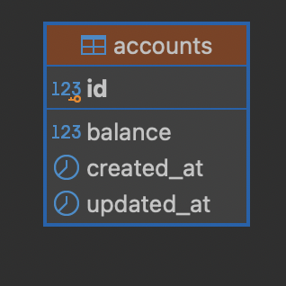
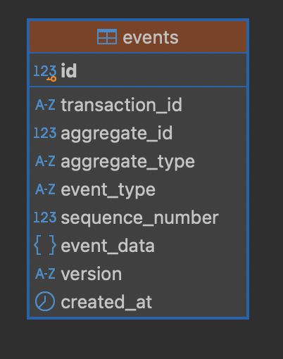
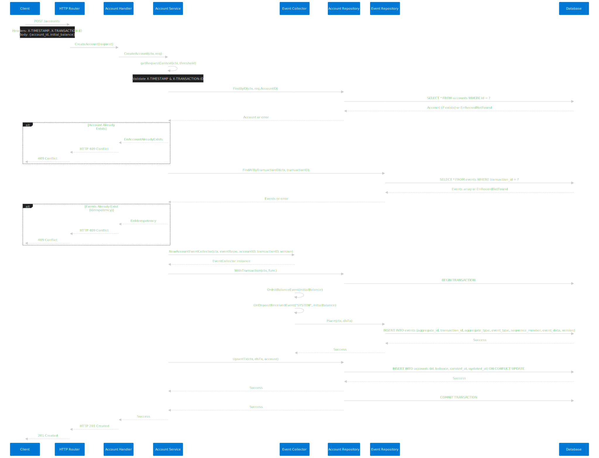
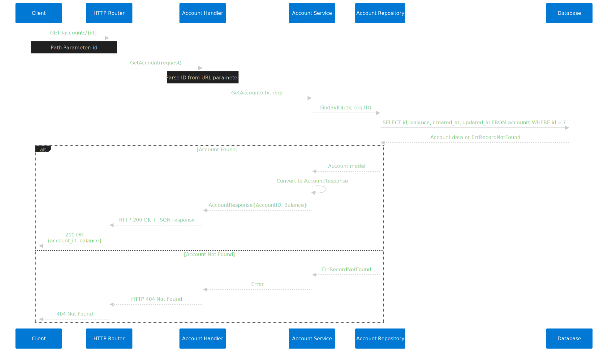
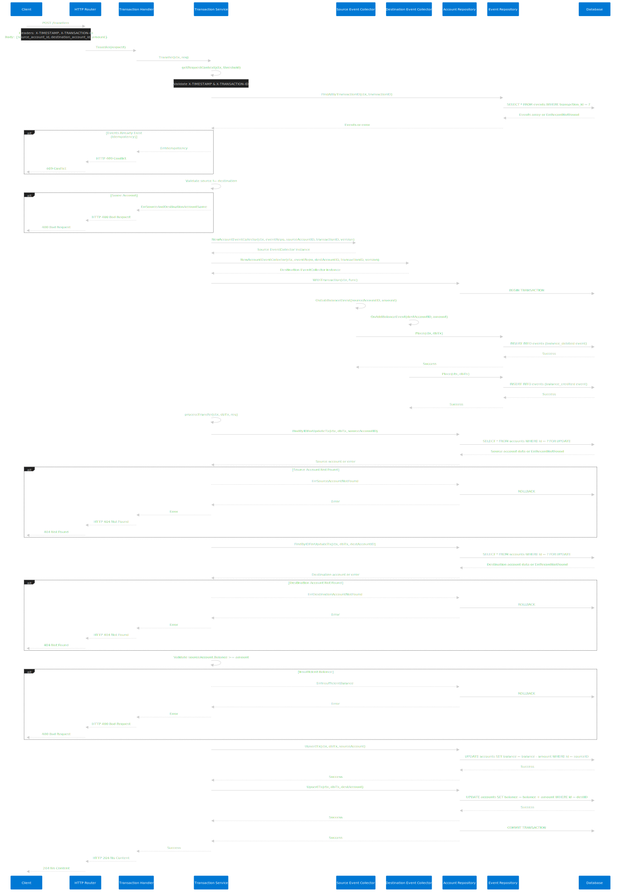

# GO Clean Architecture with Event Sourcing Schema

Maintainer: Rizal Alfarizi

Requirements:
- Go v1.23.4
- Docker
- Docker compose

## How to run
- Migrate DB using commnad `make migrate-up`
- Make environtment using command `make environment`
- Run HTTP Server using command `make run-server`

## Test
- To run all unit and integration test use command `make tests-suite`
- To run unit test use command `make tests-unit`
- To run integration test use command `make tests-integration`
- To run linter validation use commnad `make static-analysis`
- To create open api doc use command `make api-docs`
- To open swagger ui, make sure container is running and go to `http://localhost:8003/swagger/`

### Components

Components based on `docker-compose.dev.yml`:

- app: the application itself
- postgres: the database
- migrate: responsible for running and rollback database migrations
- swagger: OpenAPI documentation

### Dependencies

Beside Go official packages, this project use following 3rd party packages:

- go-kit: the application toolkit that allow us to have loosely coupled application layers
- go-chi: HTTP router
- cobra: command line application that allow us to have subcommands and parameters
- viper: application configurations loader
- go-playground/validator: request validator
- godog: cucumber tests for integration tests
- gojsonschema: JSON schema validator
- gojsonq: JSON querier
- go-testfixtures: automating load and teardown test data
- testify: test assertion helper
- cucumber: as automated integration test using gherkin scenario

# Database Design
 

# Database Schema Overview

The application uses an **Event Sourcing** pattern with two core tables:

## 1. Account Table
- **Purpose**: Real-time projection of account balances
- **Function**: Provides fast read access to current account states
- **Usage**: Direct queries for account information and balance checks

## 2. Event Table 
- **Purpose**: Complete audit log of all domain events
- **Function**: Stores the full history of all changes as immutable events
- **Key Fields**:
  - `aggregate_id`: Unique identifier for the event aggregate (e.g., account ID)
  - `aggregate_type`: Type of aggregate the event belongs to (e.g., `account`, `order`, `user`)

## Event Sourcing Pattern
- **Account Events**: When `aggregate_type = 'account'`, the `aggregate_id` contains the account ID
- **Extensibility**: The same pattern supports other aggregates (e.g., `order_id` with `aggregate_type = 'order'`)
- **Audit Trail**: Every state change is recorded as an event, enabling complete history reconstruction

## Benefits
- **Data Integrity**: Complete audit trail of all changes
- **Temporal Queries**: Ability to reconstruct account state at any point in time
- **Scalability**: Separate read (projection) and write (events) models
- **Domain Evolution**: Easy to add new aggregate types without schema changes

# Assumptions 

## Event Sourcing as Source of Truth
- **Events** serve as the authoritative timeline of all balance movements
- **Event Types**: `init_balance`, `deposit_received`, `balance_debited`, `balance_credited`
- **Replay Capability**: Events can be replayed to reconstruct account state at any specific time
- **Future Scalability**: Event data can be leveraged for OLAP (Online Analytical Processing) services

## Event Sequencing and Concurrency Control
- **Sequence Numbers**: Each event has a sequential number to maintain chronological order
- **Optimistic Locking**: Unique index on sequence numbers prevents duplicate events
- **Concurrency Safety**: Multiple events with the same sequence number are automatically rejected

## Account Projection
- **Purpose**: Stores the current/latest balance per account
- **Performance**: Provides fast OLTP (Online Transaction Processing) read access
- **Consistency**: Serves as the real-time source of truth for account balances

## Request Security and Idempotency
- **`X-TRANSACTION-ID`**: 
  - Serves as idempotency key to prevent duplicate request processing
  - Stored in event table for audit trail
  - Ensures exactly-once semantics for critical operations

- **`X-TIMESTAMP`**: 
  - Validates request timing to prevent replay attacks
  - Used in account creation and balance transfer APIs
  - Ensures requests are processed within acceptable time windows

## Security Considerations
- **Signature Verification**: Recommended for production but not implemented in this project
- **Future Enhancement**: Could be added for additional request authenticity validation

## Sequence Diagram
### Create Account
 

### Get Account
 

### Transfer balance
 